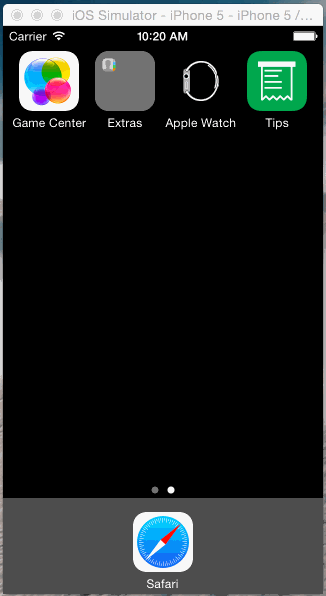

## Tips: Codepath Prework
A tip calculator that asks a single question upon load, and then reveals the rest of the UI when clicked into.

Hours to complete: 4

After following the tutorial to get the basic app setup, much of the time it took to complete was spent
watching other walkthroughs (getting the main view to move up/down the the keyboard, adjusting alphas) or fiddling
with settings.

Optional tasks completed:
* [x] Build a basic tip calculator in Swift
* [x] Animate a few custom views
* [x] Add a custom font (Helvetica Neue)
* [x] Add an app icon

Copyright © 2015 Kyle DeHovitz
